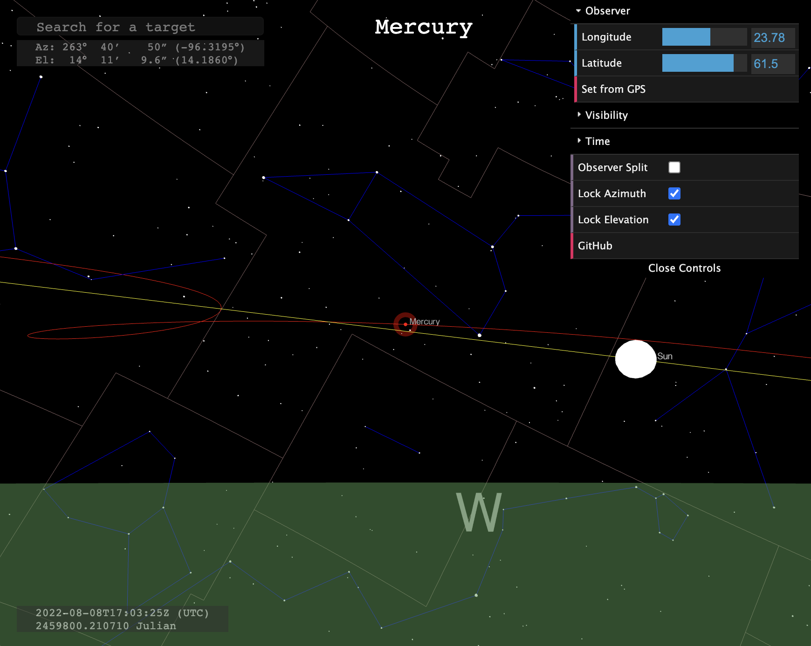

# orbits.js
Javascript library for positional astronomy.

The library implements:
* Time Correlations between TT, UT1 and TAI.
* Coordinate transformations between the following frames:
    * Heliocentric Ecliptic
    * Geocentric Ecliptic
    * J2000
    * Mean-of-Date (MoD)
    * True-of-Date (ToD)
    * Pseudo-Earth-Fixed (PEF)
    * Earth-Fixed (EFI)
    * Local Tangent Plane - East, North, Up (ENU)
* Extended Hipparcos Compliation (XHIP) stars with configurable magnitude limit.
* VSOP87A for the computation of positions of planets.
* ELP2000-82B for accurate computation of the position of the Moon with configurable truncation.
* Computation of Stellar aberration.
* Keplerian elements:
    * Approximate positions of planets.
    * Osculating Keplerian elements.
    * Keplerian propagation of orbits.
* Solar Eclipses.

The JSON files are generated as follows:
* VSOP87A : npm run vsop87a
* Hipparcos : npm run xhip
* Constellation boundaries : npm run cbnd
* ELP2000-82B : npm run elp2000

Click below to execute an example of a simple application using most features of the library.

Click below for an example drawing constellations.

Click below for an example for visualization of Solar Eclipses.

Click below to execute an example of a simple application drawing visual appearance of planets.

